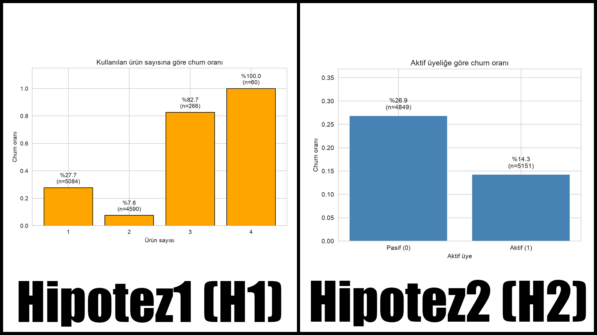
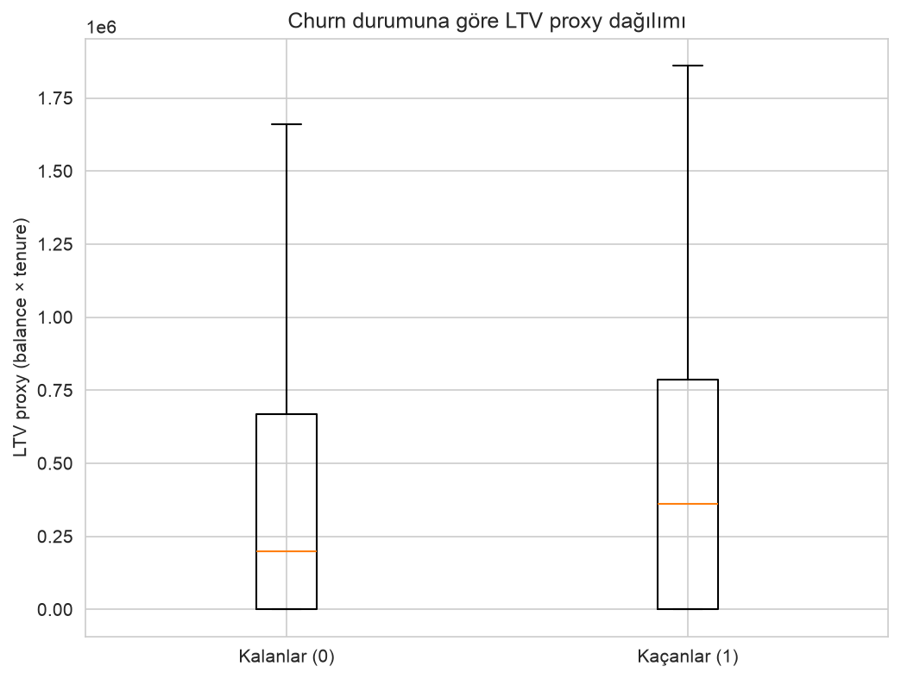
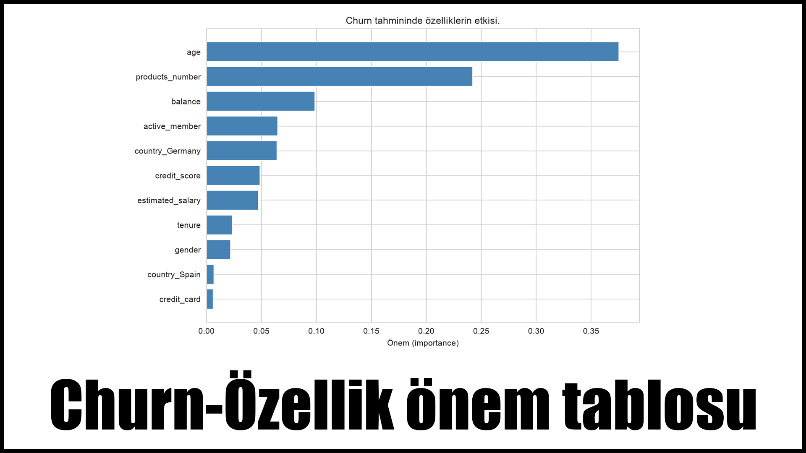

# LTV-CHURN
Bu projeyi yapmamdaki amaçlardan biri iş analitiğini öğrenmekti.
Bir şirketin müşterilerini kaybetme miktarını ve bu miktarı nasıl azaltabileceğimi düşünmeye başladım.
Yaptığım araştırmalar sonucu bazı kavramlar ile karşılaştım ve bunları öğrendim.
En son kendi fikirlerimi bir projeye aktarmaya karar verip öğrendiğim kavramları yorumlamaya karar verdim.
Bu proje'de 10.000 müşteriyi kullanarak 12 adet özellik olarak nitelendirdiğim kıstasa göre yorumlamalar yapmaya çalıştım.

Edindiğim sonuçları grafikler kullanarak yorumlamaya çalıştım.

README dosyasında sadece grafik yorumlarım bulunmaktadır. Bütün yorumlarım ltv.ipynb dosyasında bulunmaktadır.

Projem 2 hipoteze, bir LTV Proxy'e ve modele bağlı.
Hipotezlerimi de modelin sonucuyla karşılaştıracağım.

---

## HİPOTEZ-1
Birden fazla sektörde birden çok ürünü veya hizmeti bulunan bir şirket varsayalım. Bir müşterinin kullandığı ürün veya hizmet arttıkça terk etme oranı(churn) azalır diye bir düşüncem var. Beklentim bu yönde.
## HİPOTEZ-2
Bir şirketin içerisinde bulunan aktif ve pasif müşterilerin, churn oranındaki etkisini aktif müşterilerin churn oranı pasif müşterilerin churn oranından daha düşük. Bu zaten beklediğim bir sonuç.

### Hipotez-1 Sonuç:
ilk izlenimim olarak beklentimi karşılayan ve karşılamayan bir tablo olduğunu söyleyebilirim. bir ürün kullanan insanların terk etme oranı %27.7 iken 2 ürün kullanan insanların terk etme oranının büyük bir düşüşle %7.6'ya düşmesi şaşırtan bir sonuç olmadı benim için. fakat 3 ürün ve 4 ürün kullanan müşterilere bakınca terk etme oranı tam olarak bir U çiziyor, hatta beklentimi direkt olarak reddederek 4 ürün kullanan müşteriler 3 ürün kullananlardan daha fazla terk ediyor gibi gözüküyor fakat 10.000 müşterilik bir veri setinde 60 tane 4 ürün kullanan müşteri olunca buradaki 4 ürün kullanan müşterileri hesaba katmamam gerektiğini düşünüyorum. sonuç olarak vardığım kanı ilk iki örneklemde beklediğim sonuçları yani ürün sayısı-sadıklık skalasına uyan bir sonuç alıyorum. ilk iki örneklem için churn ile ürün sayısının ters orantılı olduğunu anlıyorum.

### Hipotez-2 Sonuç:
gördüğüm şey yaklaşık %27'lik pasif hesap ve %14'lük aktif hesap ve pasif olan hesapların aktif olanlara göre terk etme oranının daha yüksek olduğu. bu oran yaklaşık olarak 2 kat fark ediyor ve bu verilere güvenebileceğimi düşünüyorum çünkü 2 örneklem sahibiyim ve sayılar çok yüksek. Sonuç olarak pasif müşterileri aktif hale getirmek banka için daha fazla elde tutulan müşteri demek olabilir.

---

Bu hipotezleri yaptıktan sonra pseudo(yalancı) bir LTV proxy değeri oluşturup (balance x tenure) churn durumuna göre yorumladım.

### Yorumlarım:
Çıktıya göre kaçan müşteriler kalanlardan daha değerli gözüküyor. kaçanların medyan ltv proxy değeri yaklaşık 361.000 iken kalanların 198.000, yani neredeyse 2 kat fark var. burada dikkatimi çeken şey sadece ortalamanın değil medyanın da aynı yönü göstermesi, bu da bu farkın birkaç aşırı zengin müşteriden değil tipik kaçan müşteriden kaynaklandığını gösteriyor. yani banka değersiz müşterilerini değil tam tersine değerli müşterilerini kaybediyor, bu da churnu ciddi bir maliyet sorununa çeviriyor.

---

Son olarak eğittiğim modelde churn üzerinde özelliklerin etkisini düşündüm. Bu modeli eğitirken bazı özellikleri direkt elerken bazı özellikleri de ayırarak daha iyi bir sonuç almayı düşündüm. 

İlk modelimde %81 doğruluk oranı aldım ama bunun yanıltıcı olduğunu düşünüyorum. Daha önceden de bahsettiğim gibi veri çok dengesiz. Churn edenlerin sadece %18'ni yakalayabiliyor bu da gerçekte kaçanların büyük bir kısmını kaçırması demek. Yüksek bir doğruluk tutturmasına rağmen kaçanları yakalayamıyor o yüzden kaçanları kaçırmamaya odaklanmam gerekiyor. Yukarda bahsettiğim gibi amaç müşteriyi önceden yakalamak. Dengesizliği modele bildirip daha güçlü bir model deneyeceğim.

İkinci modelimde artık gerçekte kaçanların artık %74'nü yakalıyor ki bu benim istediğim bir şeydi fakat precision %60'tan %52'ye düştü. Bu iş açısından kabul edilebilir bir takas. Bankanın kaçacak bir müşteriyi kaçırması, kalacak birine kampanya göndermesinden daha maliyetli. Hedefime daha uygun bir model.

Modelimin verdiği sonuç şu şekilde:

Özellik-Churn dengesi grafiğim H1 ve H2 hipotezimi onayladı. H1'de elle bulduğum products_number en önemli ikinci faktörken, H2'de bulduğum active_member ise en önemli değişkenler arasında. sezgisel analizimle modelim aynı sonuca vardı. burada beklemediğim etken age'di. ayrıca getdummies ile ayırdığım ülkeler de büyük bir etken olarak karşımıza çıkıyor.

---

Veri:10.000 müşterilik banka verisi --> https://www.kaggle.com/datasets/gauravtopre/bank-customer-churn-dataset
Teknolojiler:Python, pandas, scikit-learn, matplotlib.

